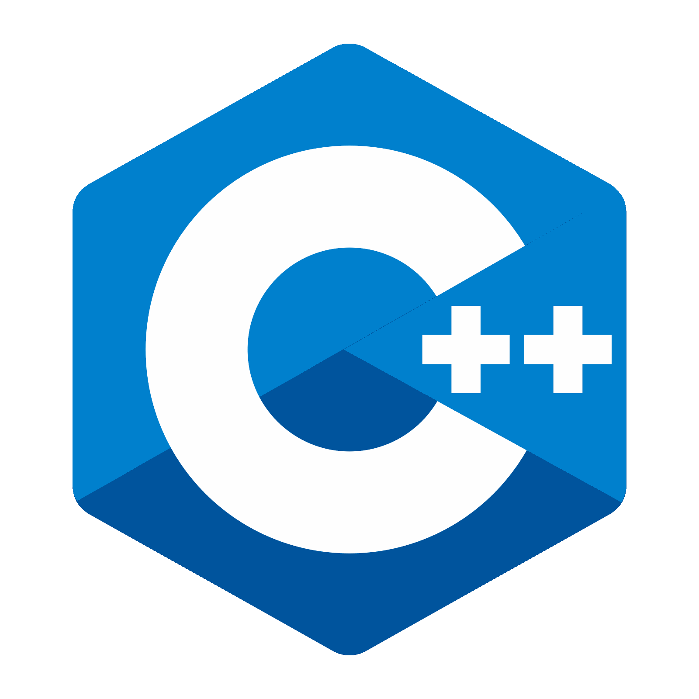
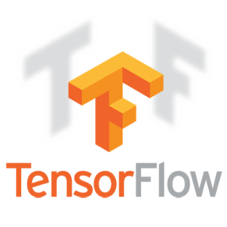

<!--
### Hi there 👋
**zwe-htet-paing/zwehtetpaing** is a ✨ _special_ ✨ repository because its `README.md` (this file) appears on your GitHub profile.

Here are some ideas to get you started:
-->

<!--
- ⚡ Fun fact: Anime, Football
- 👯 I’m looking to collaborate on ...
- 🤔 I’m looking for help with ...
- 💬 Ask me about ...
- 📫 How to reach me: ...
- 😄 Pronouns: ...
-->

<h1 align="center">Hi 👋, I'm Zwe Htet Paing </h1>
<h3 align="center">AI/Machine Learning and Computer Vision Engineer</h3>

  

* 🌍  I'm based in Yangon, Myanmar
* 🔭 Object Detection, Segementation, Pose Estimation, OCR, Action Recognition and Classification.
* 🌱 Automatic Speech Recognition and Speech to text
* 🤔 Web Scraping and Data Analysis
* 📫 You can contact me at [zwehtetpaing.works@gmail.com](mailto:zwehtetpaing.works@gmail.com)
*  ⚡ Fun fact: Anime, Football

<h3 align="left">Connect with me:</h3>

 

 
 
 

### _Language_

 
 
 

### _Main Tools_

 
 
 

### _Other Tools_

 
 
 

### _Status_

<!--  -->
  
<!--  -->

